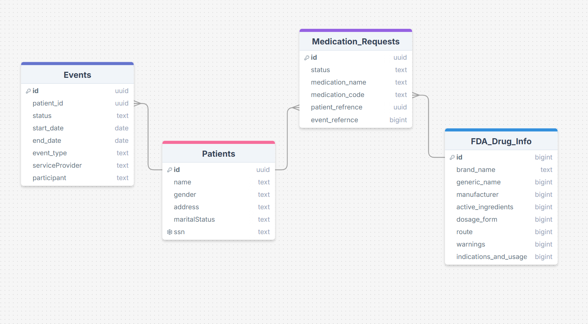

# FHIR ETL Project

## **Project Description**
You are provided with the data of 100 dummy patients in JSON format adhering to the FHIR (Fast Healthcare Interoperability Resources) standard. Your task is to convert this data into structured tables in an SQL database by extracting relevant fields from the JSON files. Additionally, you are required to query the FDA Drug Label API to obtain medication information for all medications in the patient dataset and create a corresponding table in the SQL database.

Furthermore, you need to containerize your application in a reproducible manner and use a scheduler to automate the workflow of data extraction, transformation, and loading (ETL) into the SQL database.

**Deadline 5:20 PM Sunday 24 Nov.**

---

## **Requirements**

### Data Extraction and Transformation
1. Extract relevant fields from the FHIR JSON files.
2. Convert the extracted data into structured tables.
3. Query the FDA Drug Label API to obtain medication information.
4. Create a table for all medications in the SQL database.

### Data Loading
1. Load the structured tables into an SQL database.

### Containerization
1. Containerize the application using Docker.
2. Ensure the container is reproducible and can be easily deployed.

### Scheduling
1. Use a scheduler to automate the ETL workflow.

---
# Project Structure:
### **Directories**

- **DB**: Contains all database-related files.
- **FHIR Data**: Holds the raw data files.

## 1. **Scripts**

### **Extract.py**
- Fetches data from the FHIR json files and FDA API .
- 

### **Transform.py**
- Reads raw data into pandas dataframes.
- Cleans and formats data for database insertion.


### **Load.py**
- Creates database tables using pre-written SQL schemas. 
- Insert proccessed data to the DB tables

### **sql_queries**
- Hold the queries needed by the Load.py to load the data into the DB.


### **How It All Fits Together**
- The main.py script manages the entire ETL process by calling the functions from the Extract, Transform, and Load modules, ensuring a smooth flow of data from extraction, through transformation, and finally into the database.


-----

## 2. **DB Tables**
```bash
cd DB
sqlite3 FHIR_DB.db < schema.sql
```
Or the Load script will create them for you if not exist

### **SQL Schema**


### **Patients Table**
| Column        | Type    | Description                      |
|---------------|---------|----------------------------------|
| id            | TEXT    | Primary key (UUID from FHIR).    |
| name          | TEXT    | Patient's full name.            |
| gender        | TEXT    | Gender of the patient.          |
| birth_date    | DATE    | Birthdate of the patient.       |
| address       | TEXT    | Address of the patient.         |
| maritalStatus | TEXT    | Marital status of the patient.  |
| ssn           | TEXT    | Unique SSN of the patient.      |

### **Medication_Requests Table**
| Column         | Type    | Description                      |
|----------------|---------|----------------------------------|
| id             | TEXT    | Primary key (UUID from FHIR).    |
| patient_id     | TEXT    | Foreign key (Patient.id).        |
| medication_id  | TEXT    | RXCode of the medication.        |
| dosage         | TEXT    | Dosage instructions.            |
| start_date     | DATE    | Start date of the prescription. |

### **FDA_Drug_Info Table**
| Column         | Type    | Description                      |
|----------------|---------|----------------------------------|
| drug_id         | TEXT    | Primary key (matches medication_id). |
| brand_name     | TEXT    | Brand name of the medication.   |
| generic_name   | TEXT    | Generic name of the medication. |
| manufacturer   | TEXT    | Manufacturer details.           |
| active_ingredients | TEXT | Active ingredients.            |
| warnings       | TEXT    | Safety warnings.                |
| indications    | TEXT    | Indications and usage.          |

### **Events Table**
| Column         | Type    | Description                      |
|----------------|---------|----------------------------------|
| id             | TEXT    | Primary key  |
| patient_id     | TEXT    | foriegn key of Patient(id) |
| status         | TEXT    | the status of the event |
| start_date     | Date    |          |
| end_date       | Data    |           |
| event_type     | TEXT    | type of the event    |
| serviceProvider| TEXT    | Hospital or clinic provided the service  |
| participant   | TEXT | Dr or person who provided the service 


---


## 3. **Docker Container**

### 1. **Install Docker**
[Docker's website](https://www.docker.com/get-started).

### 2. **Create or Edit**:
- **Dockerfile**: Defines how your container will be built.
- **requirements.txt**: Add any Python dependencies.

### 3. **Build the Docker Image and Run it**
```bash
# Build the Docker image
docker build -t fhir-etl .

# Run the container
docker run --rm -it fhir-etl 
```

----

### **Scheduling the Docker App using Windows Task Scheduler**

1. **Create a Script to Run the Docker App**  
   `fhir-etl-app.bat` file with this content:
   ```bat
   @echo off
    echo [%date% %time%] Starting fhir-etl Docker App
    docker run --rm -it fhir-etl 
    echo [%date% %time%] Docker fhir-etl App Finished
    pause
   ```


2. **Set Up the Task in Task Scheduler**
   - Open **Task Scheduler** (search for it in the Start menu).
   - Click **Create Task** in the Actions menu.


3. **Configure the Task**
   - **General Tab**:
     - Name the task (e.g., *Run Docker App*).
     - Check **Run whether user is logged on or not**.
     - Check **Run with highest privileges**.

   - **Triggers Tab**:
     - Set when the task should run on a specific schedule.

   - **Actions Tab**:
     - Select **Start a Program**.
     - Point it to your `fhir-etl-app.bat` file.


4. **Test the Task**
   - In Task Scheduler, right-click your task and select **Run**.
   - Confirm that your Docker app starts successfully.


---

## **Example SQL Queries to verify insertion**
- Verify the number of unique patients:
  ```sql
  SELECT COUNT(DISTINCT id) AS unique_patients FROM Patients;
  ```

- Get medications for a specific patient:
  ```sql
  SELECT * FROM Medication_Requests WHERE patient_id = 'some_patient_id';
  ```

- Get data from multiple table:
  ```sql
  SELECT p.name, p.gender, p.address, mr.medication_name, e.event_type
  FROM Medication_Requests mr
  JOIN Patients p on mr.patient_reference = p.id
  JOIN Events e on mr.event_reference = e.id and e.patient_id = p.id
  where mr.status = 'active';
  ```
  - Get medications FDA related data:
  ```sql
  SELECT mr.medication_name, fda.brand_name, fda.manufacturer_name
  FROM Medication_Requests mr
  join FDA_Drug_Info fda on mr.medication_code = fda.drug_id
  where fda.warnings = 'N/A';
  ```

  # References
  1. [Patient Resource Reference](https://www.hl7.org/fhir/patient.html)
  2. [MedicationRequests Resource Reference](https://www.hl7.org/fhir/medicationrequest.html)
  3. [Encounters Resource Reference](https://www.hl7.org/fhir/encounter.html)
  4. [FDA Drug Label API](https://open.fda.gov/apis/#:~:text=Tobacco%20API%20Endpoints-,About%20the%20openFDA%20API,-openFDA%20is%20an)

  5. [How to Use the API Endpoint](https://open.fda.gov/apis/drug/label/how-to-use-the-endpoint/)

  
  
